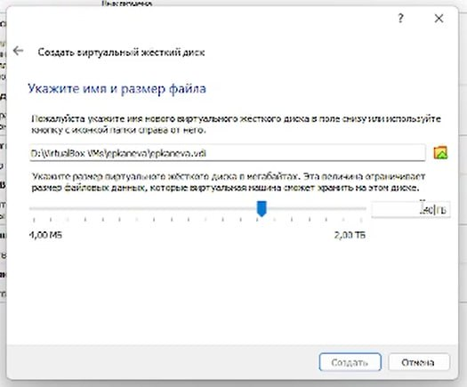
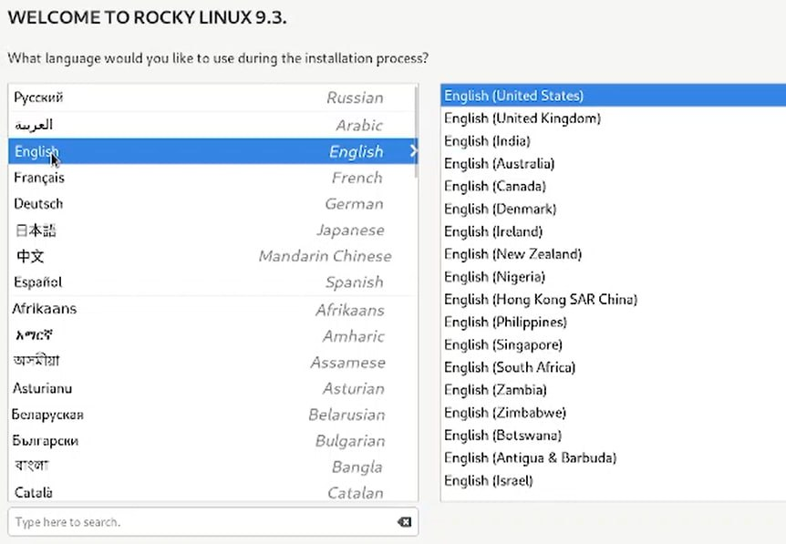
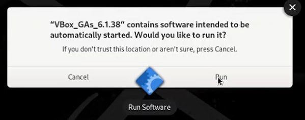
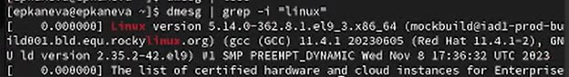
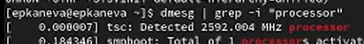
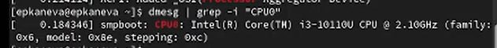
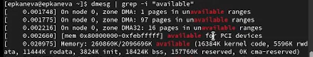
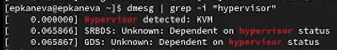
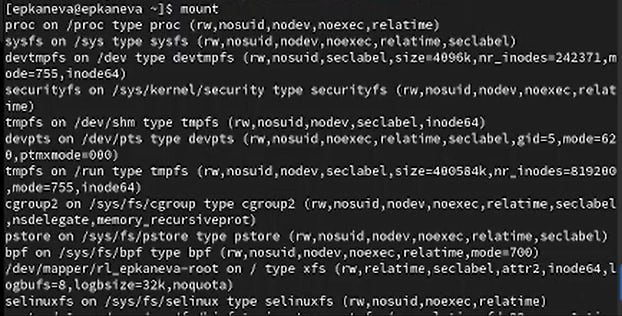

---
## Front matter
lang: ru-RU
title: Лабораторная работа №1
subtitle: Операционные системы
author:
  - Канева Е.П., НКАбд-02-22

## i18n babel
babel-lang: russian
babel-otherlangs: english

## Formatting pdf
toc: false
toc-title: Содержание
slide_level: 2
aspectratio: 169
section-titles: true
theme: metropolis
header-includes:
 - \metroset{progressbar=frametitle,sectionpage=progressbar,numbering=fraction}
 - '\makeatletter'
 - '\beamer@ignorenonframefalse'
 - '\makeatother'
---

# Вводная часть

## Цель работы

Целью данной работы является приобретение практических навыков установки операционной системы на виртуальную машину, настройки минимально необходимых для дальнейшей работы сервисов.

## Задачи

* Установка операционной системы на виртуальную машину.
* Настройка виртуальной машины.
* Получить следующую информацию:
 * Версия ядра Linux (Linux version).
 * Частота процессора (Detected Mhz processor).
 * Модель процессора (CPU0).
 * Объём доступной оперативной памяти (Memory available).
 * Тип обнаруженного гипервизора (Hypervisor detected).
 * Тип файловой системы корневого раздела.
 * Последовательность монтирования файловых систем.

# Процесс выполнения

## Установка виртуальной машины

- Была установлена программа Oracle VM VirtualBox, на которую была позже установлена операционная система
- Некоторые пункты из настройки вирутальной машины:
 - Создан вирутальный жёсткий диск динамического типа
 - Задан объём жёсткого диска и выбран путь к нему:
 
 {width=50%}
 
## Установка виртуальной машины

 - Установлен язык интерфейса:
 
 {width=50%}

## Добавление дополнительного образа ОС

- Добавлен образ гостевой ОС:

{#fig:016 width=50%}

# Дополнительное задание

## Версия ядра

Далее была начата работа по выполнению "домашнего задания". С помощью различных команд (в основном, `dmesg`) была получена следующая информация:

1. Версия ядра Linux, т.е. Linux version:

{width=50%}

## Частота процессора

2. Частота процессора, т.е. Detected Mhz processor

{width=50%}

## Модель процессора

3. Модель процессора, т.е. CPU0

{width=50%}

## Объём доступной памяти

4. Объём доступной оперативной памяти, т.е. Memory available

{width=70%}

## Тип файловой системы корневого раздела

5. Тип файловой системы корневого раздела, Для этого заходим в приложение `Disks`

Тип: ext4.

## Тип гипервизора

6. Тип обнаруженного гипервизора, т.е. Hypervisor detected

{width=50%}

## Последовательность монтирования файловых систем

{width=70%}

# Результаты

## Выводы

Установили ОС на виртуальную машину и настроили минимально необходимые для дальнейшей работы программы и сервисы. Узнали дополнительную информацию о машине.
