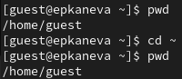
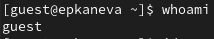
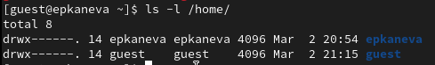
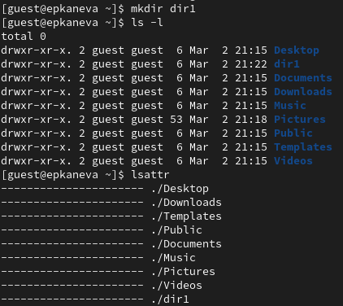
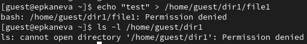

---
## Front matter
lang: ru-RU
title: Лабораторная работа №2
subtitle: Информационная безопасность
author:
  - Канева Е.П., НКАбд-02-22

## i18n babel
babel-lang: russian
babel-otherlangs: english

## Formatting pdf
toc: false
toc-title: Содержание
slide_level: 2
aspectratio: 169
section-titles: true
theme: metropolis
header-includes:
 - \metroset{progressbar=frametitle,sectionpage=progressbar,numbering=fraction}
 - '\makeatletter'
 - '\beamer@ignorenonframefalse'
 - '\makeatother'
---

# Вводная часть

## Цель работы

Получение практических навыков работы в консоли с атрибутами файлов, закрепление теоретических основ дискреционного разграничения доступа в современных системах с открытым кодом на базе ОС Linux.

## Задачи

1. В установленной при выполнении предыдущей лабораторной работы операционной системе создайте учётную запись пользователя guest (использую учётную запись администратора):
 ```useradd guest```
2. Задайте пароль для пользователя guest (использую учётную запись администратора):
```passwd guest```
3. Войдите в систему от имени пользователя guest.
4. Определите директорию, в которой вы находитесь, командой `pwd`. Сравните её с приглашением командной строки. Определите, является ли она вашей домашней директорией? Если нет, зайдите в домашнюю директорию.
5. Уточните имя вашего пользователя командой `whoami`.

## Задачи

6. Уточните имя вашего пользователя, его группу, а также группы, куда входит пользователь, командой `id`. Выведенные значения uid, gid и др. запомните. Сравните вывод id с выводом команды `groups`.
7. Сравните полученную информацию об имени пользователя с данными, выводимыми в приглашении командной строки.
8. Просмотрите файл /etc/passwd командой `cat /etc/passwd`. Найдите в нём свою учётную запись. Определите uid пользователя. Определите gid пользователя. Сравните найденные значения с полученными в предыдущих пунктах.
9. Определите существующие в системе директории командой `ls -l /home/`. Удалось ли вам получить список поддиректорий директории /home? Какие права установлены на директориях?

## Задачи

10. Проверьте, какие расширенные атрибуты установлены на поддиректориях, находящихся в директории /home, командой:
```lsattr /home```
11. Создайте в домашней директории поддиректорию dir1 командой `mkdir dir1 `. Определите командами `ls -l` и `lsattr`, какие права доступа и расширенные атрибуты были выставлены на директорию dir1.
12. Снимите с директории dir1 все атрибуты командой `chmod 000 dir1` и проверьте с её помощью правильность выполнения команды `ls -l`.

## Задачи

13. Попытайтесь создать в директории dir1 файл file1 командой `echo "test" > /home/guest/dir1/file1`. Объясните, почему вы получили отказ в выполнении операции по созданию файла? Оцените, как сообщение об ошибке отразилось на создании файла? Проверьте командой `ls -l /home/guest/dir1` действительно ли файл file1 не находится внутри директории dir1.
14. Заполните таблицу «Установленные права и разрешённые действия», определив опытным путём, какие операции разрешены, а какие нет.
15. На основании заполненной таблицы определите те или иные минимально необходимые права для выполнения операций внутри директории dir1, заполните табл. 2.2.

# Процесс выполнения

## Создание пользователя

Сначала была создана учётная запись пользователя guest. Далее текущий пользователь был сменён на guest. Была проверена текущая директория (рис. [-@fig:01]):

{#fig:01 width=50%}

## Проверка текущего пользователя

Далее был проверен текущий пользователь командой `whoami` (рис. [-@fig:02]):

{#fig:02 width=50%}

## Имя, группа пользователя

Далее я уточнила имя пользователя, его группу, а также группы, куда входит пользователь, командой `id, также ввела команду `groups` (рис. [-@fig:04]):

{#fig:04 width=50%}

## Имя, группа пользователя

Далее был просмотрен файл `etc/passwd` командой `cat /etc/passwd | grep guest` (рис. [-@fig:05]):

{#fig:05 width=50%}

## Директории

Определила существующие в системе директории командой `ls -l /home/` (рис. [-@fig:06]). Удалось получить список поддиректорий директории `/home`. Права видны на картинке.

{#fig:06 width=30%}

## Атрибуты и права

Создала в домашней директории поддиректорию dir1 командой `mkdir dir1 `. Определила командами `ls -l` и `lsattr`, какие права доступа и расширенные атрибуты были выставлены на директорию dir1 (рис. [-@fig:08]).

{#fig:08 width=40%}

## Попытка создания файла

Сняла с директории dir1 все атрибуты командой `chmod 000 dir1` и проверила с её помощью правильность выполнения команды `ls -l`. Попыталась создать в директории dir1 файл file1 командой `echo "test" > /home/guest/dir1/file1` (рис. [-@fig:10]). Получила отказ в выполнении операции по созданию файла, потому что не хватило прав.

{#fig:10 width=50%}

## Таблицы

Были заполнены нужные таблицы.

# Результаты

## Выводы

Получила практические навыки работы в консоли с атрибутами файлов, закрепила теоретические основы дискреционного разграничения доступа в современных системах с открытым кодом на базе ОС Linux.
