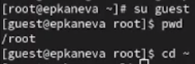

---
## Front matter
lang: ru-RU
title: Лабораторная работы №3
subtitle: Информационная безопасность
author:
  - Екатерина Канева, НКАбд-02-22
institute:
  - Российский университет дружбы народов
date: 16.03.2024

## i18n babel
babel-lang: russian
babel-otherlangs: english

## Formatting pdf
toc: false
toc-title: Содержание
slide_level: 2
aspectratio: 169
section-titles: true
theme: metropolis
header-includes:
 - \metroset{progressbar=frametitle,sectionpage=progressbar,numbering=fraction}
 - '\makeatletter'
 - '\beamer@ignorenonframefalse'
 - '\makeatother'
---

# Вводная часть

## Цель и задачи

Цель: получение практических навыков работы в консоли с атрибутами файлов для групп пользователей.

Задания:

1. Создать пользователя guest2.
2. Провести работу с группами пользователей.
3. Заполнить таблицы с правами пользователей.

# Выполнение работы

## Создание пользователя guest2

{#fig:1 width=50%}

## Вход как guest и guest2

В одном окне консоли вошла как guest, в другом как guest2 (рис. [-@fig:2]):

{#fig:2 width=40%}

## Проверка групп пользователей

Проверила группы пользователя guest (рис. [-@fig:4]):

{#fig:4 width=30%}

## Проверка групп пользователей

Проверила группы пользователя guest2 (рис. [-@fig:5]):

{#fig:5 width=30%}

## `/etc/passwd`

Нашла информацию о группах пользователей guest и guest2 в `/etc/passwd` (рис. [-@fig:7]):

{#fig:7 width=40%}

## Работа с dir1

Изменила атрибуты и права на каталог dir1 для пользоваnеля guest и проверила это (рис. [-@fig:8]):

{#fig:8 width=30%}

## Заполнение таблиц

Далее я приступила к изменению атрибутов от имени пользователя guest и проверке изменений от пользователя guest2. 

# Заключение

## Вывод

Получили практические навыки работы в консоли с атрибутами файлов для групп пользователей.
