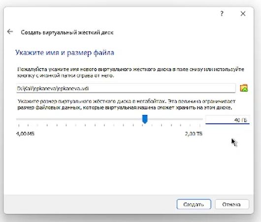
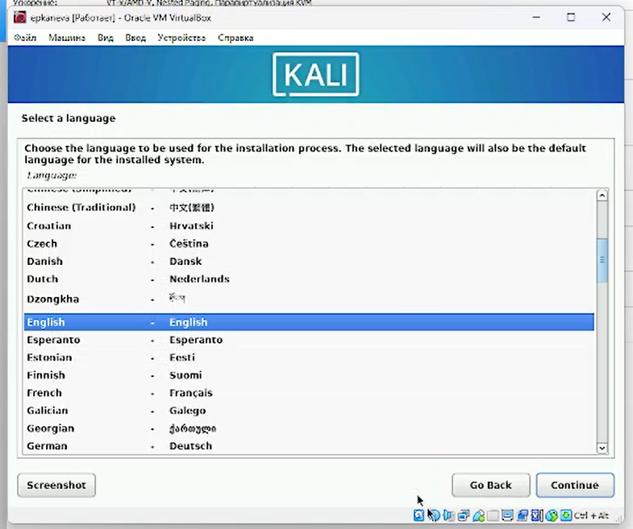
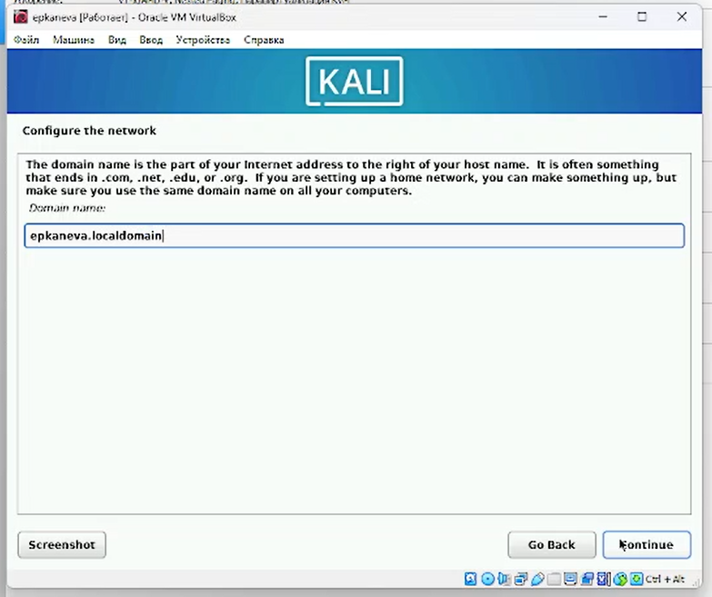
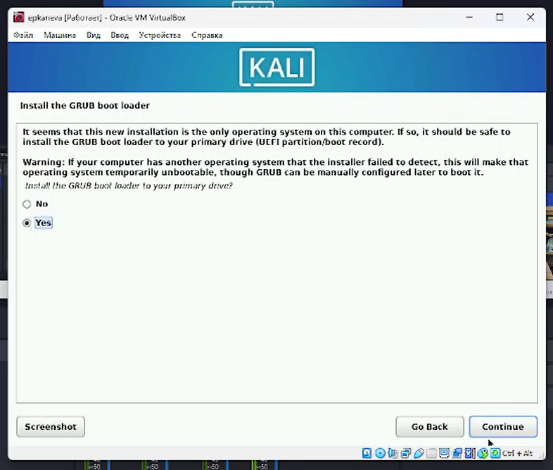
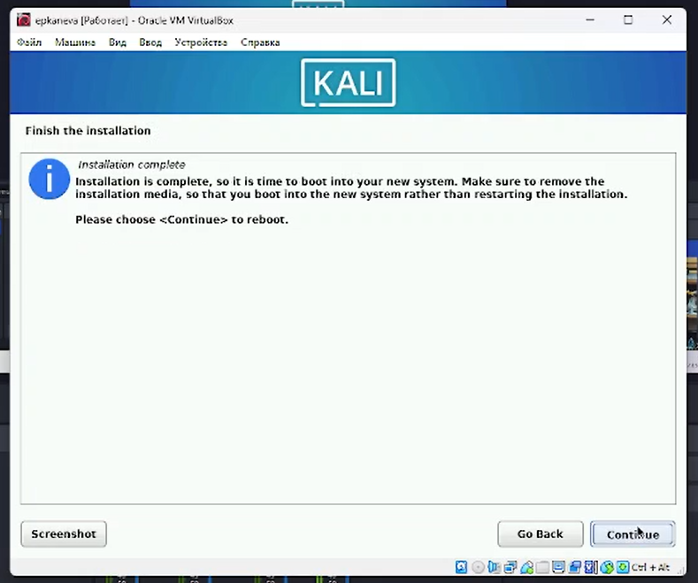
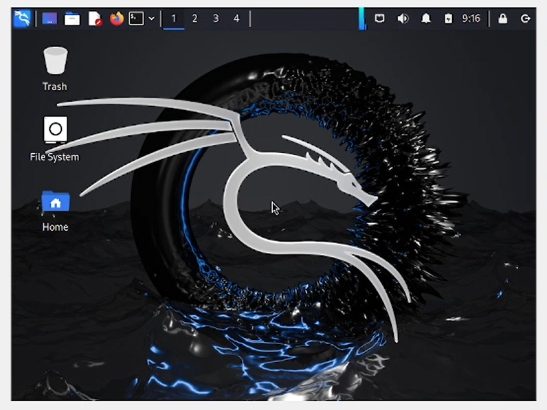

---
## Front matter
lang: ru-RU
title: Лабораторная работа №1
subtitle: Операционные системы
author:
  - Канева Е.П., НКАбд-02-22

## i18n babel
babel-lang: russian
babel-otherlangs: english

## Formatting pdf
toc: false
toc-title: Содержание
slide_level: 2
aspectratio: 169
section-titles: true
theme: metropolis
header-includes:
 - \metroset{progressbar=frametitle,sectionpage=progressbar,numbering=fraction}
 - '\makeatletter'
 - '\beamer@ignorenonframefalse'
 - '\makeatother'
---

# Вводная часть

## Цель работы

Установить дистрибутив Kali Linux на виртуальную машину.

# Процесс выполнения

## Установка виртуальной машины

- Была установлена программа Oracle VM VirtualBox, на которую была позже установлена операционная система
- Некоторые пункты из настройки вирутальной машины:
 - Создан вирутальный жёсткий диск динамического типа
 - Задан объём жёсткого диска и выбран путь к нему:
 
{width=50%}
 
## Установка виртуальной машины

 - Установлен язык интерфейса:
 
{width=50%}

## Добавление дополнительного образа ОС

Были заданы имя хоста, локального домена (рис. [-@fig:11]), имя и пароль для пользователя.

{#fig:11 width=50%}

## Установка GRUB

Был установлен GRUB (рис. [-@fig:14]):

{#fig:14 width=50%}

## Перезагрузка машины

Выполнена перезагрузка (рис. [-@fig:15]), виртуальная машина работает (рис. [-@fig:16]):

{#fig:15 width=50%}

## Машина работает

{#fig:16 width=50%}

# Результаты

## Выводы

Установили Kali Linux на виртуальную машину.
