---
## Front matter
title: "Отчёт по первому этапу проекта"
subtitle: "Информационная безопасность"
author: "Екатерина Павловна Канева"

## Generic otions
lang: ru-RU
toc-title: "Содержание"

## Bibliography
bibliography: bib/cite.bib
csl: pandoc/csl/gost-r-7-0-5-2008-numeric.csl

## Pdf output format
toc: true # Table of contents
toc-depth: 2
lof: true # List of figures
lot: true # List of tables
fontsize: 12pt
linestretch: 1.5
papersize: a4
documentclass: scrreprt
## I18n polyglossia
polyglossia-lang:
  name: russian
  options:
	- spelling=modern
	- babelshorthands=true
polyglossia-otherlangs:
  name: english
## I18n babel
babel-lang: russian
babel-otherlangs: english
## Fonts
mainfont: PT Serif
romanfont: PT Serif
sansfont: PT Sans
monofont: PT Mono
mainfontoptions: Ligatures=TeX
romanfontoptions: Ligatures=TeX
sansfontoptions: Ligatures=TeX,Scale=MatchLowercase
monofontoptions: Scale=MatchLowercase,Scale=0.9
## Biblatex
biblatex: true
biblio-style: "gost-numeric"
biblatexoptions:
  - parentracker=true
  - backend=biber
  - hyperref=auto
  - language=auto
  - autolang=other*
  - citestyle=gost-numeric
## Pandoc-crossref LaTeX customization
figureTitle: "Рис."
tableTitle: "Таблица"
listingTitle: "Листинг"
lofTitle: "Список иллюстраций"
lotTitle: "Список таблиц"
lolTitle: "Листинги"
## Misc options
indent: true
header-includes:
  - \usepackage{indentfirst}
  - \usepackage{float} # keep figures where there are in the text
  - \floatplacement{figure}{H} # keep figures where there are in the text
---

# Цель работы

Установить дистрибутив Kali Linux на виртуальную машину.

# Выполнение лабораторной работы

Работа выполнялась на персональном ноутбуке.

Предварительно было установлено дополнительно программное обеспечение – виртуальная машина Oracle VM VirtualBox (пакет Windows hosts с сайта в сети Интернет: [здесь](https://www.virtualbox.org/wiki/Downloads)) и образ необходимый образ операционной системы (Kali Linux).

Создана новая машина. В графе `Имя` был указан логин в дисплейном классе – `epkaneva`; в графе `Тип` – `Linux`; в графе `Версия` - `Debian 64-bit` (рис. [-@fig:01]):

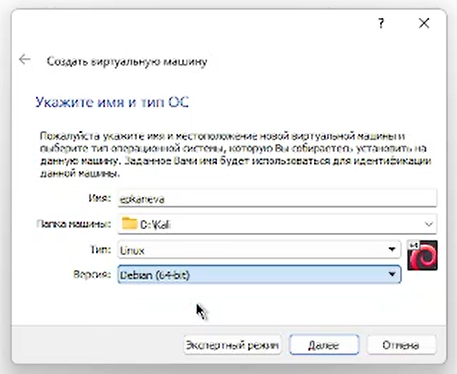{#fig:01 width=70%}

Далее был выбран объём памяти – 2048 Мб (рис. [-@fig:02]):

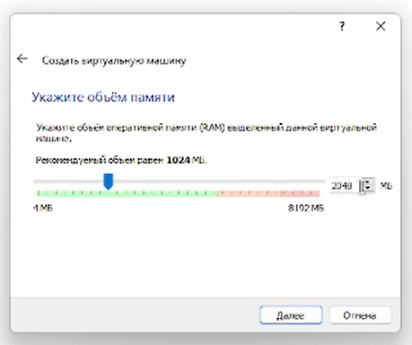{#fig:02 width=70%}

Далее был создан виртуальный жёсткий диск (рис. [-@fig:03]), выбран тип `VDI (VirtualBox Disk Image)` (рис. [-@fig:04]), выбран динамический тип жёсткого диска (рис. [-@fig:05]):

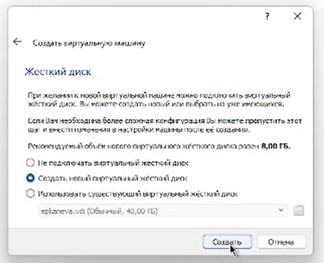{#fig:03 width=70%}

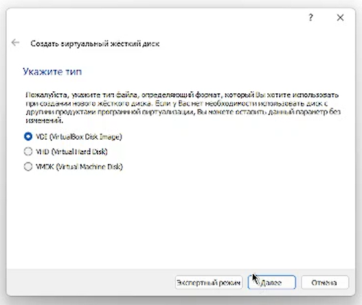{#fig:04 width=70%}

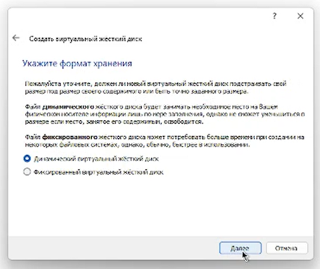{#fig:05 width=70%}

Далее для виртуального жёсткого диска был задан объём 40 Гб (рис. [-@fig:06]):

{#fig:06 width=70%}

После этого был выбран образ жёсткого диска (рис. [-@fig:07]):

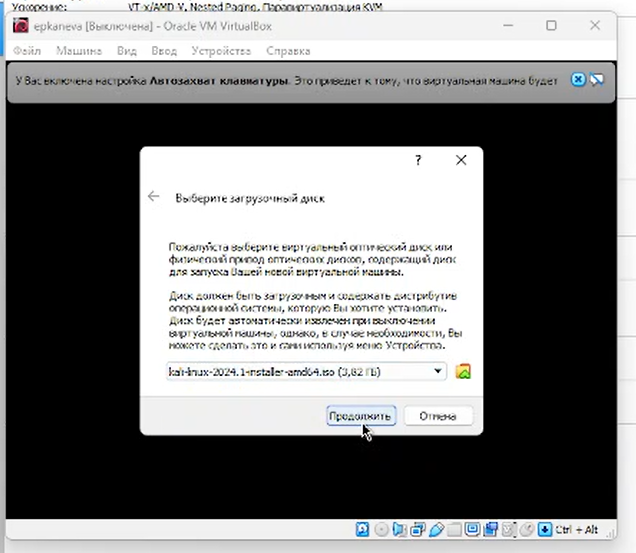{#fig:07 width=70%}

Далее была выбрана установка через гарфический интерфейс (рис. [-@fig:08]):

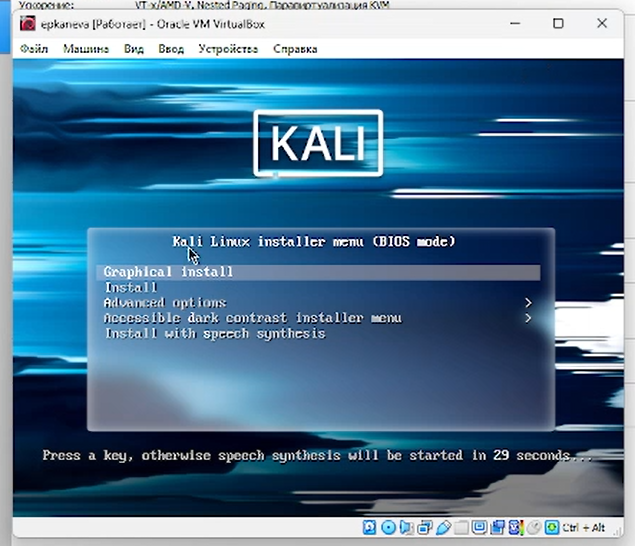{#fig:08}

Далее запустился процесс установки. В качестве языка интерфейса был выбран английский язык (рис. [-@fig:09]), была выбрана английская раскладка.

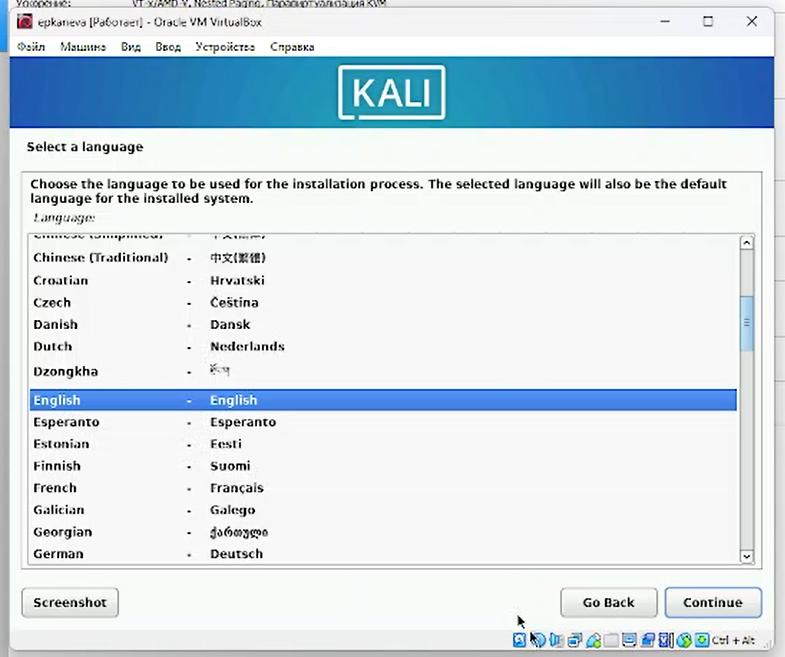{#fig:09 width=70%}

Далее были заданы имя хоста (рис. [-@fig:10]), локального домена (рис. [-@fig:11]), имя и пароль для пользователя.

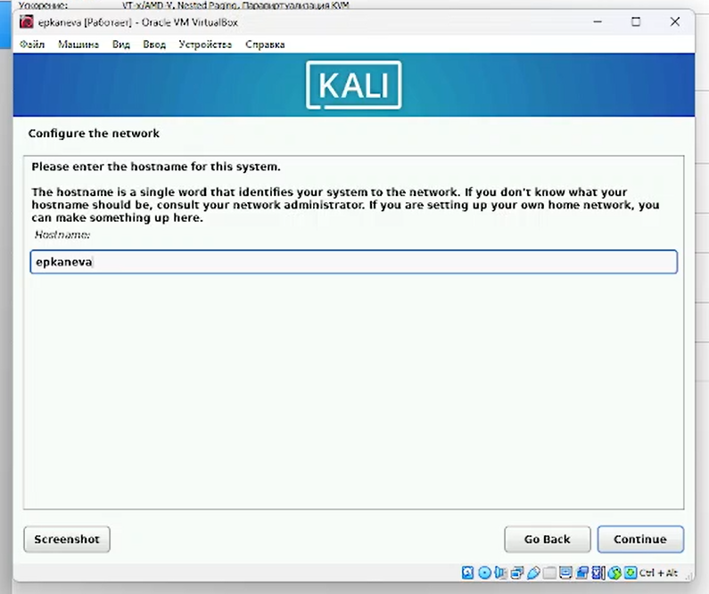{#fig:10 width=70%}

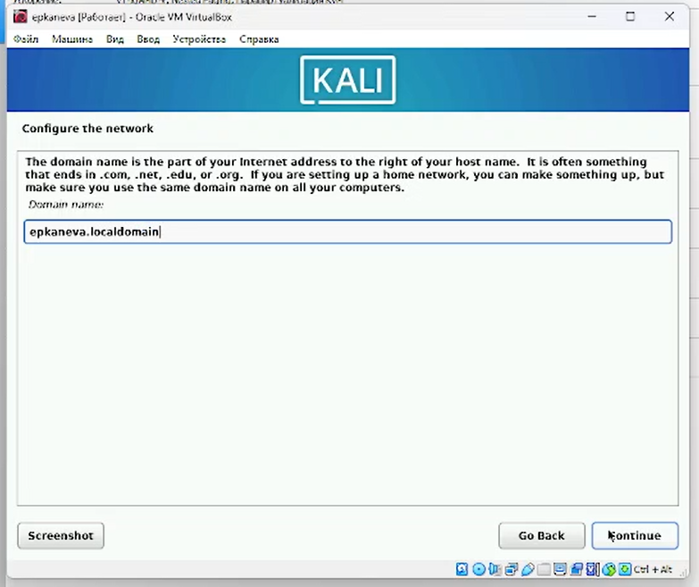{#fig:11 width=70%}

Далее были выбраны характеристики для (не)разбиения диска (рис. [-@fig:12]), началась запись на диск (рис. [-@fig:13]):

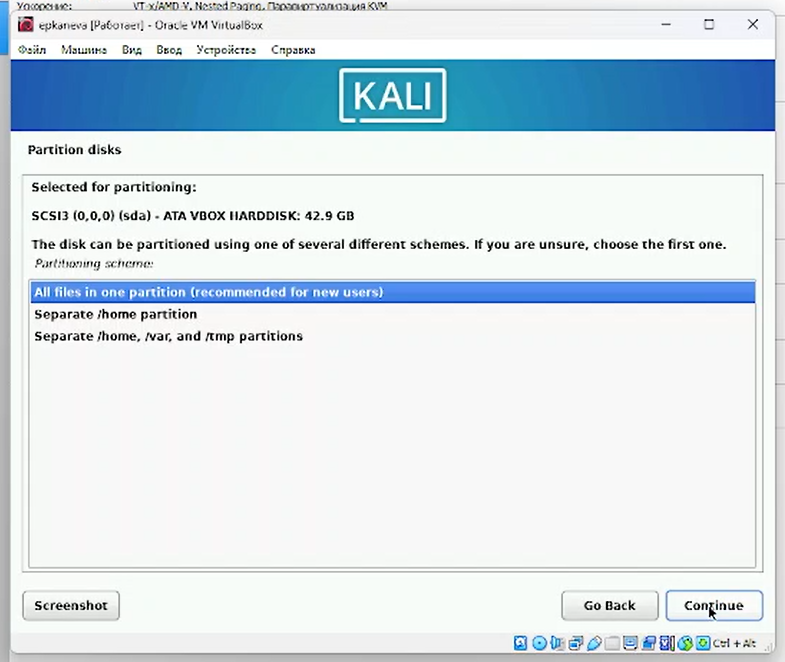{#fig:12 width=70%}

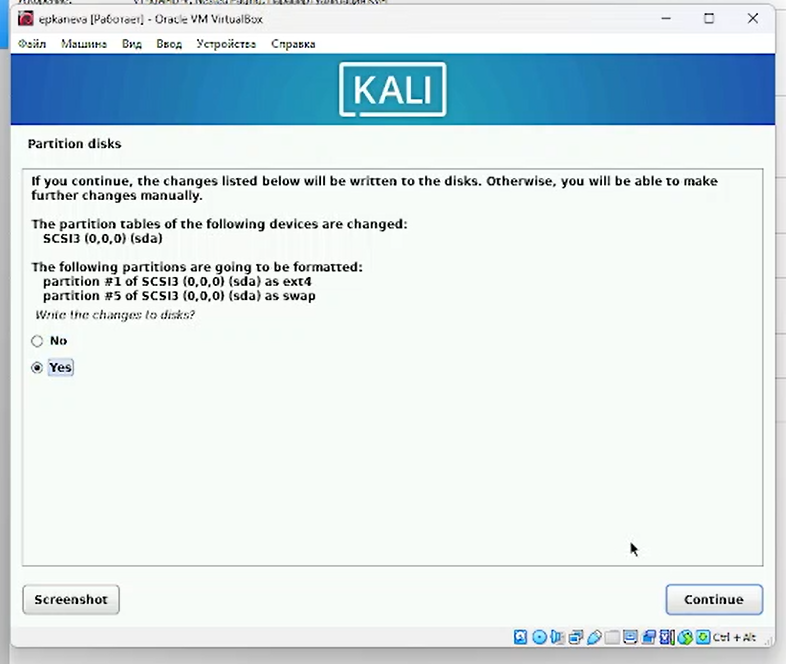{#fig:13 width=70%}

Потом был установлен GRUB (рис. [-@fig:14]):

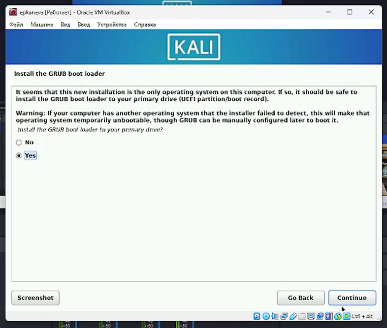{#fig:14 width=70%}

Выполнена перезагрузка (рис. [-@fig:15]), виртуальная машина работает (рис. [-@fig:16]):

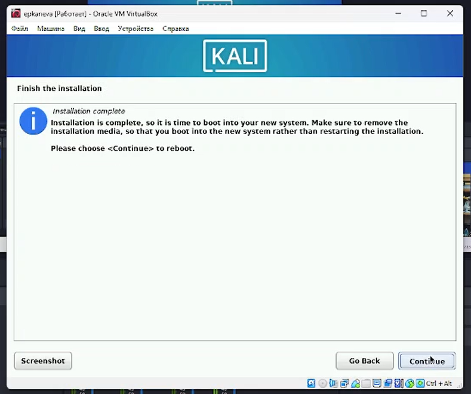{#fig:15 width=70%}

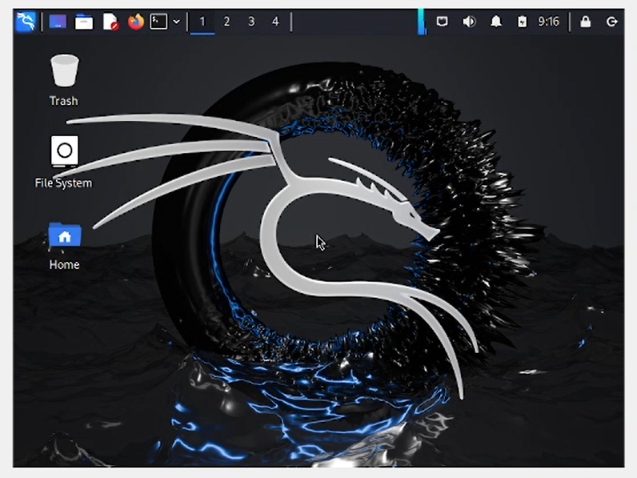{#fig:16 width=70%}

# Выводы

Установили Kali Linux на виртуальную машину.
