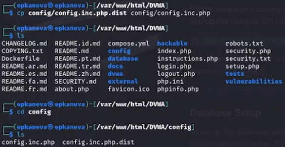
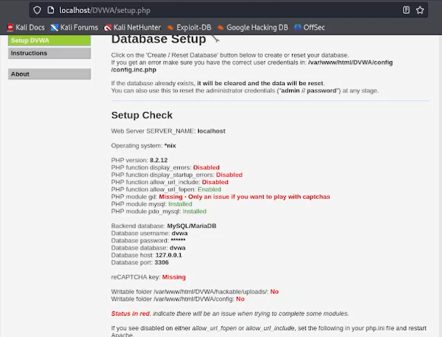

---
## Front matter
lang: ru-RU
title: Проект — этап 2
subtitle: Информационная безопасность
author:
  - Екатерина Канева, НКАбд-02-22
institute:
  - Российский университет дружбы народов
date: 16.03.2024

## i18n babel
babel-lang: russian
babel-otherlangs: english

## Formatting pdf
toc: false
toc-title: Содержание
slide_level: 2
aspectratio: 169
section-titles: true
theme: metropolis
header-includes:
 - \metroset{progressbar=frametitle,sectionpage=progressbar,numbering=fraction}
 - '\makeatletter'
 - '\beamer@ignorenonframefalse'
 - '\makeatother'
---

# ЦВводная часть

## Цель работы

Установить и настроить DVWA.

# Выполнение

## Клонирование репозитория

{#fig:1 width=50%}

## Запуск apache

{#fig:3 width=40%}

## Создание config

{#fig:4 width=50%}

## Запуск DVWA

{#fig:5 width=70%}

## Запуск и настройка БД

{#fig:7 width=50%}

## Входим под новым пользователем

{#fig:8 width=80%}

## Создала БД в DVWA

{#fig:9 width=30%}

# Результаты

## Выводы

Установили и настроили DVWA.